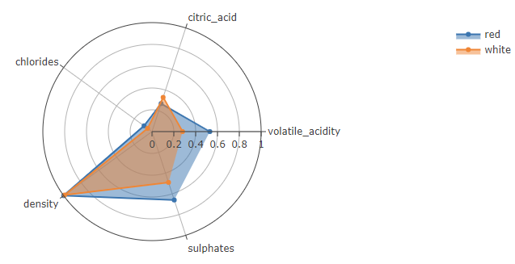
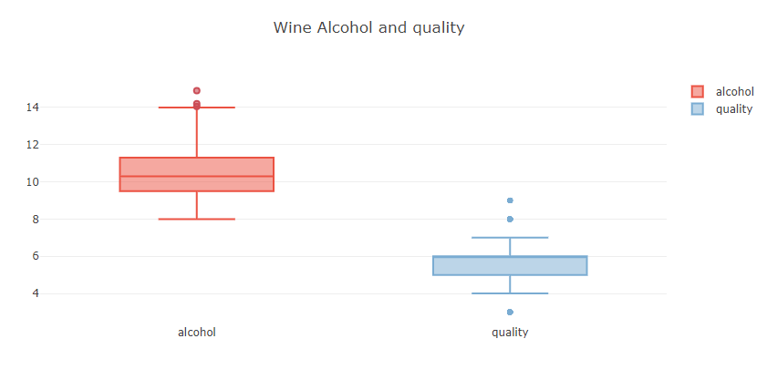
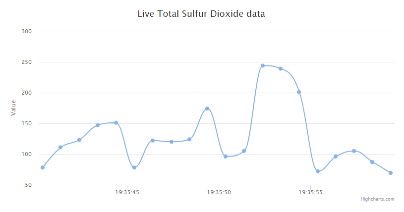

# 주간업무보고

## Week 1: 개발환경 셋팅

1. 깃허브 계정 생성 (완료)

    * https://github.com/eunbinhyun

 

2. 개발환경 구성 (완료)

    * JDK/Tomcat/mybatis Eclipse 설치 
    
    * Database, table 생성 후 데이터 input

 

3. Spring, Mariadb, MyBatis 연동 (완료)

    * Dao, Service, Home Controller, VO 작성

    * [이슈1] root-context.xml파일 <context:component-scan> 에러

          하단 Namespaces탭에서 context에 체크

    * [이슈2] C:\..\log4j.dtd 지정된 파일을 찾을 수 없음

          log4j.dtd를 http://logging.apache.org/log4j/1.2/apidocs/org/apache/log4j/xml/doc-files/log4j.dtd로 수정

    * [이슈3] Context initialized 이벤트를 [org.springframework.web.context.ContextLoaderListener] 클래스의 인스턴스인 리스너에 전송하는 동안 예외 발생

          spring-jdbc 버전을 spring 버전과 동일하게 변경 (5.1.8)

 

4. 기타

    * 1주차 온라인 세션 : 직무소개 및 과제 소개

      - 일시 : 8월 5일 20:00 ~ 22:00

      - 참석자 : 리드멘토 이외 멘티

 

## Week 2: 차트선택, 테스트

1. 차트 테스트 (완료)

   * d3.js 차트 선택
   
   * charttest프로젝트 생성 후 chart_ex.html, data.tsv 작성
    
 

2. API Interface Guide 작성 (완료)

   * [인터페이스 가이드 문서](https://github.com/eunbinhyun/sw-spring/blob/master/doc/%EC%9D%B8%ED%84%B0%ED%8E%98%EC%9D%B4%EC%8A%A4%20%EA%B0%80%EC%9D%B4%EB%93%9C%20%EB%AC%B8%EC%84%9C.docx)

 

## Week 3: RestController, DataBinding

1. Spring : Rest Controller를 이용한 데이터 처리 (jackson) (완료)

   * visualize_pilot 프로젝트 생성

   * pom.xml에 Jackson library 추가

   * restController.java 작성

 

2. DataBinding을 위한 화면 구조 변경, 지원 작성 (완료)

   * home.jsp 수정

   * common_resource.jsp, home.css, home.js, jquery-1.12.4min.js 추가

   * servlet-context.xml 수정

 

3. 기타

   * 3주차 온라인 세션 : API 문서, spring 및 과제 소개
   
      - 일시: 8월 19일 20:00 ~ 22:00
      
      - 참석자 : 리드멘토 이외 멘티

 

## Week 4: spring을 활용한 차트 개발

1. 프로젝트 셋팅 (완료)

   * wine_quality 프로젝트 생성

   * kaggle에서 wine_quality csv 다운

   * 데이터베이스, 테이블 생성

 

2. 데이터로 차트그리기 (완료)

   * test.xml 쿼리문
  
          SELECT alcohol, quality, total_sulfur_dioxide FROM PRODUCT_QUALITY          
          SELECT type, ROUND(AVG(volatile_acidity),2) AS volatile_acidity, ROUND(AVG(citric_acid),2) AS citric_acid, ROUND(AVG(chlorides), 2) AS chlorides, ROUND(AVG(sulphates), 2) AS sulphates, ROUND(AVG(density), 2) AS density FROM PRODUCT_QUALITY GROUP BY TYPE
          
   * home.js, home.jsp, home.css 작성
   
   * plotly.min.js, highchart 활용
   
   

   

   

      
      
